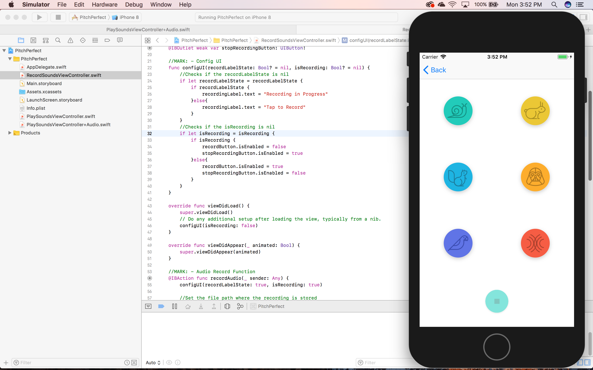

# PitchPerfect

## Repo Summary
Pitch Perfect manipulates recordings to fast and slow speed, high and low pitch, and echo and non-echo. This app was built using Apple's AVFoundation framework, which is used to access camera, microphone and video editing tools. In this project I used it to access the recording feature and used the libraries within that scope to manipulate the recording. The code that handled the manipulation was built by Udacity, I used their class which used AVFoundation to get the feature working.

## SETUP / USAGE / HOW TO
To run Pitch Perfect please make sure that your computer's operating system is Macintosh and you have the latest version of XCode.

## FAQ / CONTACT / TROUBLESHOOT
If you're running into any problems please contact me at sajjadp92@outlook.com

## CONTRIBUTORS
TheIronLord (sajjadp92@outlook.com)
